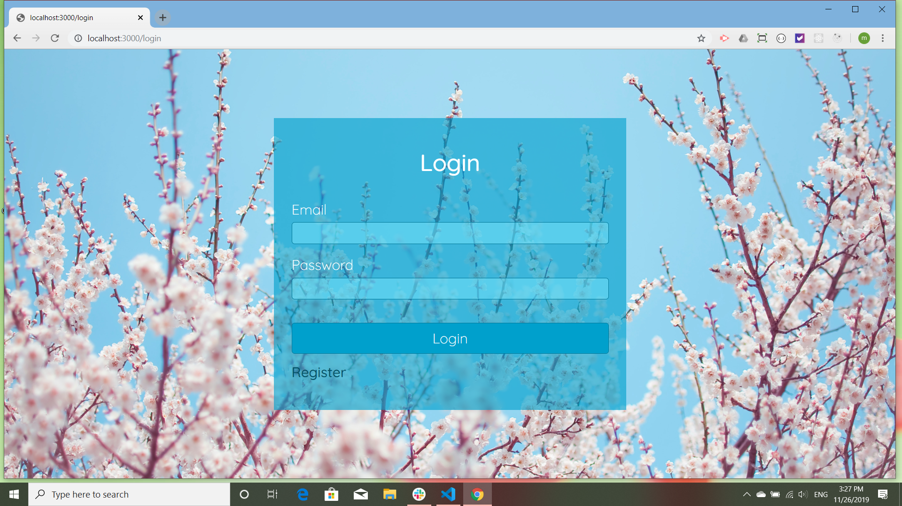
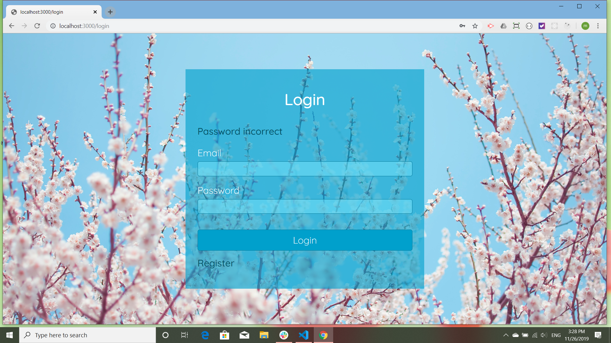
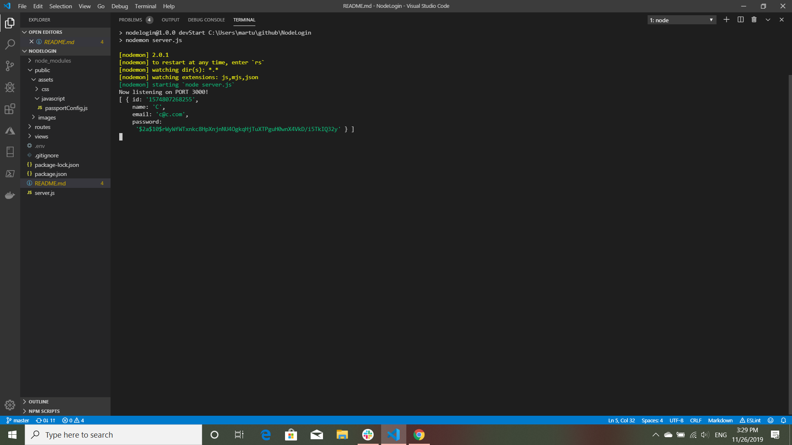
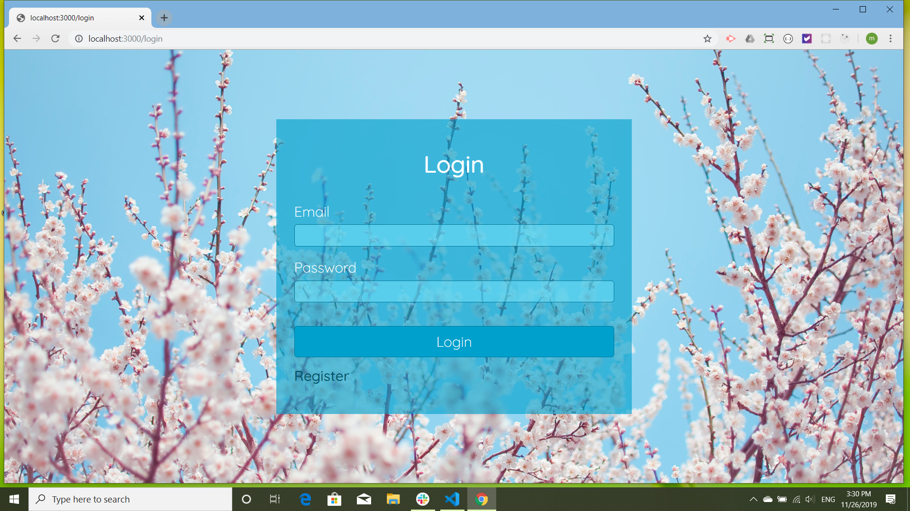

##Node Login

Node login is a very simple login made an empty array instead of a database. Thus it does not permanently store data, the user being saved for as long as the program is open.

The program come from [Web Dev Simplified](https://www.youtube.com/watch?v=-RCnNyD0L-s) and uses express, passport and ejs.

Since intially deploying this program, I have gone back and restyled it based on another Web Dev Simplified tutorial called ["Transparent Login Form"](https://www.youtube.com/watch?v=nLxA9froMOs). I used the tutorial to style the initial login, adjusting where necessary, and used the modified the code for the registration and index views. The background images are from [Unsplash](https://unsplash.com/). The cherry blossom picture is by [Narubono](https://unsplash.com/@narubono), the garlic? blossoms are by [Eddie Howell](https://unsplash.com/s/photos/howell), and the jellyfish are by [Zetong Li](https://unsplash.com/s/photos/zetong-li).

In addition I changed the file structure so that the routes are now out of the server, and the script is in a file in the public folder. This change was merely recreational.
 
 Here is how the login opens. One will not already be registered as there is no database, so one goes to the registration page and registers(note the link to registration):
 

Here is the registration page filled out for the user Lettuce C.:

Here Lettuce has forgotten her password! (Silly Lettuce!) Note the error message:

Here Lettuce has correctly logged in:

And now she logs out:

 Again this is a very simple login system, but I enjoyed it as a learning tool. Thanks Web Dev Simplified!

 This app is deployed on heroku at: [DeployedApp](https://vast-stream-09563.herokuapp.com/login)